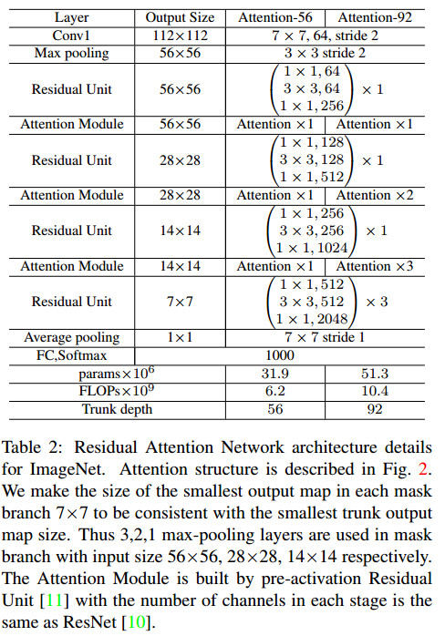

## 1. Squeeze-and-Excitation Networks 


```python
from torch import nn

class SELayer(nn.Module):
    def __init__(self, channel, reduction=16):
        super(SELayer, self).__init__()

        //返回1X1大小的特征图，通道数不变
        self.avg_pool = nn.AdaptiveAvgPool2d(1)
        self.fc = nn.Sequential(
            nn.Linear(channel, channel // reduction, bias=False),
            nn.ReLU(inplace=True),
            nn.Linear(channel // reduction, channel, bias=False),
            nn.Sigmoid()
        )

    def forward(self, x):
        b, c, _, _ = x.size()

        //全局平均池化，batch和channel和原来一样保持不变
        y = self.avg_pool(x).view(b, c)

        //全连接层+池化
        y = self.fc(y).view(b, c, 1, 1)

        //和原特征图相乘
        return x * y.expand_as(x)
   
```


## 2. Residual Attention Network for Image Classification 




## 3.  Non-local Neural Networks 


## 4. CBAM: Convolutional Block Attention Module 


## 5. Spatial Transformer Networks


